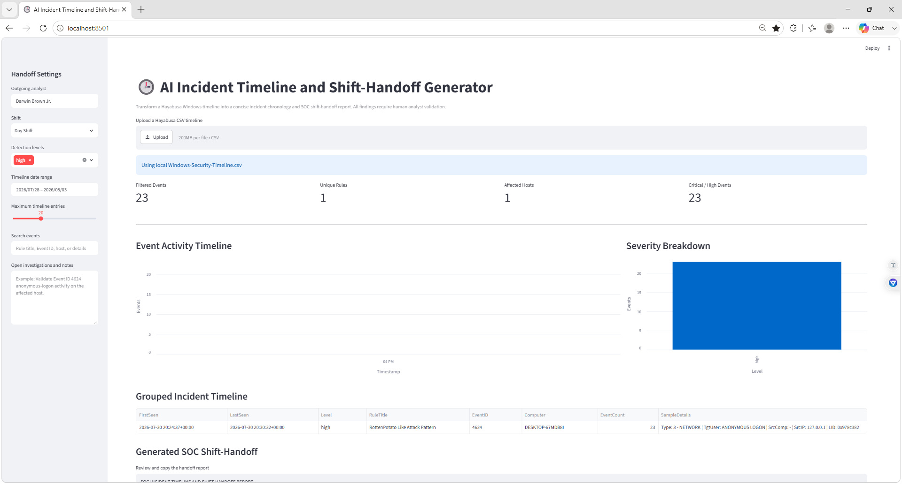
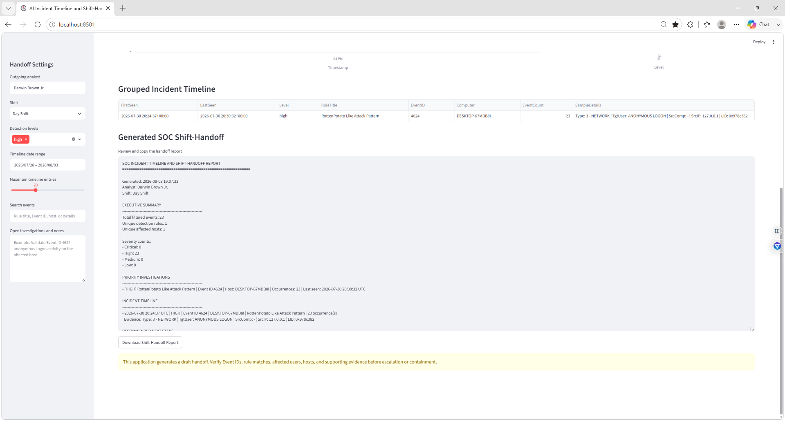

# Darwin-SOC-AI-Incident-Timeline-Shift-Handoff-Generator
SOC Tier 1 Streamlit application that converts Hayabusa Windows event data into a grouped incident timeline, priority investigation queue, and downloadable shift-handoff report for analyst review.
> The current version uses transparent rule-based filtering, grouping, and report generation. It is designed as an AI-ready workflow that can later incorporate a local Ollama model for narrative summaries and investigation suggestions.

---

## 🎯 Project Objectives

- Load a Hayabusa CSV timeline
- Normalize Windows event fields
- Sort security events chronologically
- Filter events by severity and date
- Group repeated detections
- Identify affected hosts and detection rules
- Build a concise incident timeline
- Generate a SOC shift-handoff report
- Record open investigations and analyst notes
- Export the handoff as a text file
- Preserve human validation before escalation or containment

---

## 🧠 Why This Project Matters

SOC analysts frequently change shifts while investigations are still open.

A poor handoff can cause:

- Missed alerts
- Duplicate work
- Lost investigation context
- Delayed escalation
- Incorrect alert closure
- Important evidence being overlooked

A useful shift handoff should explain:

- What happened
- When it happened
- Which systems were affected
- Which alerts remain open
- What evidence has already been reviewed
- What the incoming analyst should do next

This dashboard creates a repeatable handoff structure while keeping the final decision with the human analyst.

---

## 🛠️ Technologies Used

- Python
- Streamlit
- Pandas
- Hayabusa
- Windows Security Event Logs
- PowerShell
- CSV
- Text report generation
- Windows 11
- SOC Tier 1 investigation methods

---

## 🏗️ Project Workflow

```text
Windows Security Log
        ↓
Hayabusa Detection Timeline
        ↓
Windows-Security-Timeline.csv
        ↓
Pandas Field Normalization
        ↓
Severity and Date Filtering
        ↓
Repeated Alert Grouping
        ↓
Incident Timeline Generation
        ↓
Priority Investigation Summary
        ↓
SOC Shift-Handoff Report
        ↓
Human Analyst Validation
```

---

## 📁 Repository Structure

```text
Darwin-AI-Incident-Timeline-Shift-Handoff-Generator/
│
├── handoff_dashboard.py
├── README.md
├── .gitignore
│
└── screenshots/
    ├── 01-AI-Incident-Timeline-Dashboard-Overview.png
    └── 02-AI-SOC-Shift-Handoff-Report.png
```

The original Windows event timeline is not included because it may contain local usernames, hostnames, security identifiers, IP addresses, and other sensitive system information.

---

## ⚙️ Environment Setup

### 1. Create the project folder

```powershell
cd "C:\Users\Darwin Brown\Downloads"
mkdir AI-Incident-Shift-Handoff
cd .\AI-Incident-Shift-Handoff
```

### 2. Create a virtual environment

```powershell
python -m venv handoffvenv
```

### 3. Activate the environment

```powershell
.\handoffvenv\Scripts\Activate.ps1
```

### 4. Install required packages

```powershell
python -m pip install streamlit pandas
```

### 5. Copy the Hayabusa timeline

```powershell
Copy-Item "C:\Users\Darwin Brown\Downloads\hayabusa-3.10.0-win-x64\Windows-Security-Timeline.csv" ".\Windows-Security-Timeline.csv"
```

---

## ▶️ Running the Application

Start the Streamlit dashboard with:

```powershell
streamlit run handoff_dashboard.py
```

If needed, run the virtual-environment executable directly:

```powershell
.\handoffvenv\Scripts\streamlit.exe run handoff_dashboard.py
```

The application opens locally at:

```text
http://localhost:8501
```

---

## 📥 Timeline Input

The dashboard accepts a Hayabusa CSV timeline through either:

- The local file `Windows-Security-Timeline.csv`
- The Streamlit CSV upload control

The application searches for common Hayabusa field names and normalizes them into:

```text
Timestamp
Level
RuleTitle
EventID
Computer
Details
Channel
RuleID
```

This allows the dashboard to work even when some column names differ slightly.

---

## 🔍 Detection-Level Filtering

The sidebar allows the analyst to filter by detection level:

```text
critical
high
med
medium
low
informational
```

The project demonstration focused on high-severity detections.

The analyst can also filter by:

- Date range
- Rule title
- Event ID
- Computer
- Event details
- Maximum timeline entries

---

## 🧩 Repeated Alert Grouping

Repeated alerts are grouped using:

```text
Rule title
Severity level
Event ID
Computer
```

Each grouped timeline entry includes:

- First-seen timestamp
- Last-seen timestamp
- Severity
- Rule title
- Event ID
- Computer
- Number of occurrences
- Sample event details
- Channel
- Rule ID

This reduces repetitive event rows and creates a more readable timeline for the incoming analyst.

---

## 📊 Dashboard Metrics

The dashboard displays:

- Filtered event count
- Unique detection rules
- Affected hosts
- Critical and high-severity event count

During the lab, the filtered dataset contained:

```text
23 filtered events
1 unique detection rule
1 affected host
23 critical/high events
```

---

## 📈 Event Activity Timeline

The application resamples matching events into hourly activity counts.

This helps the analyst identify:

- Bursts of activity
- Repeated alerts in a short period
- Investigation start and end times
- Periods of elevated detection activity
- Potential automated or repeated behavior

---

## 📋 Grouped Incident Timeline

The grouped incident timeline included:

```text
Rule title: RottenPotato Like Attack Pattern
Severity: High
Event ID: 4624
Affected host: DESKTOP-67MDB8I
Occurrences: 23
```

The sample event details included:

```text
Logon type: Network
Target user: ANONYMOUS LOGON
Source IP: 127.0.0.1
```

A rule match does not automatically prove malicious activity. The original event evidence must be reviewed.

---

## 📝 Generated Shift-Handoff Report

The dashboard generates a structured text report containing:

```text
Executive Summary
Priority Investigations
Incident Timeline
Recommended Next Steps
Open Investigations / Analyst Notes
Handoff Reminder
```

The report includes:

- Generation time
- Outgoing analyst
- Shift name
- Filtered event count
- Unique rule count
- Affected host count
- Severity totals
- Priority alert summaries
- Chronological timeline entries
- Analyst-entered notes
- Human-validation warning

---

## 📥 Report Export

The generated handoff can be downloaded as:

```text
SOC-Shift-Handoff-Report.txt
```

The report can support:

- Shift transitions
- Analyst handoff
- Case documentation
- Incident escalation
- Manager review
- Investigation tracking
- SOC training exercises

---

## 📸 Screenshots

### 1. AI Incident Timeline Dashboard Overview



The dashboard overview shows:

- Outgoing analyst field
- Shift selection
- Detection-level filtering
- Timeline date range
- Search controls
- Analyst notes
- 23 filtered events
- 1 unique rule
- 1 affected host
- 23 high-severity events
- Event activity timeline
- Severity breakdown
- Grouped incident timeline

The grouped result identified repeated Event ID 4624 detections associated with the `RottenPotato Like Attack Pattern` rule.

---

### 2. AI SOC Shift-Handoff Report



The generated handoff report includes:

- Analyst name
- Shift name
- Executive summary
- Severity counts
- Priority investigation
- Event ID 4624
- Affected host
- Detection occurrence count
- Incident timeline
- Sample evidence
- Download button
- Human-validation reminder

The report summarized 23 high-severity detections into one grouped investigation entry.

---

## 🚨 Investigation Reviewed

The primary grouped detection was:

```text
RottenPotato Like Attack Pattern
```

The matching event was:

```text
Windows Event ID 4624
```

Event ID 4624 represents a successful account logon.

A successful logon is not automatically malicious. The analyst should review:

- Logon type
- Authentication package
- Target account
- Target domain
- Source address
- Source port
- Source workstation
- Logon ID
- Process information
- Related privilege events
- Nearby process-creation events
- Whether the activity was expected

---

## 🛡️ Recommended SOC Tier 1 Actions

The generated report recommends that the incoming analyst:

1. Validate the detection against the raw Windows event.
2. Review the affected user and host.
3. Confirm the logon type and authentication package.
4. Examine source IP addresses and ports.
5. Correlate matching Logon IDs.
6. Search for related process and privilege events.
7. Compare the activity with approved administrative work.
8. Review SIEM and EDR telemetry.
9. Document false-positive explanations before closing alerts.
10. Escalate only when evidence supports suspicious or malicious activity.

---

## ✍️ Example Analyst Note

An outgoing analyst could enter:

```text
Validate the anonymous logon activity, confirm whether 127.0.0.1
traffic is expected, and correlate Event ID 4624 with nearby
privilege and process-creation events.
```

This note is added to the final handoff report so the incoming analyst knows what remains open.

---

## 🧠 Human-in-the-Loop Validation

The application does not automatically:

- Close alerts
- Escalate incidents
- Isolate computers
- Disable accounts
- Block IP addresses
- Suppress detection rules
- Confirm compromise

Every generated summary must be reviewed against the original event evidence.

The dashboard is a communication and triage tool, not an autonomous incident-response system.

---

## ⚠️ Limitations

The current version has several limitations:

- Rule-based filtering rather than generative AI analysis
- No automatic threat-intelligence enrichment
- No user or host behavioral baseline
- No asset-criticality scoring
- No EDR integration
- No SIEM case-management integration
- No automatic MITRE ATT&CK validation
- No persistent database
- No alert ownership tracking
- No report-editing workflow
- Repeated detections may represent either noise or repeated attacks

The current sample dataset also contained only one high-severity grouped rule, so the activity chart was limited.

---

## 🔮 Future AI Integration

A future version could use a local Ollama model to generate:

- Plain-English incident summaries
- Investigation questions
- MITRE ATT&CK suggestions
- Missing-evidence warnings
- Shift-handoff narratives
- Escalation summaries
- Analyst note drafts
- False-positive explanations

AI-generated content should remain advisory and require analyst validation.

---

## 🧠 What I Learned

- How to process a Hayabusa CSV timeline
- How to normalize inconsistent field names
- How to parse security timestamps
- How to filter events by severity and date
- How to group repeated security alerts
- How to create a chronological incident timeline
- How to build Streamlit sidebar controls
- How to generate SOC handoff reports
- How to export text reports
- How to document open investigations
- Why strong shift handoffs matter in SOC operations
- Why automated summaries require human validation

---

## 💼 Skills Demonstrated

- SOC Tier 1 alert triage
- Incident timeline development
- Shift-handoff documentation
- Windows Event Log analysis
- Hayabusa
- Python
- Streamlit
- Pandas
- PowerShell
- CSV processing
- Data normalization
- Event grouping
- Severity filtering
- Incident reporting
- Analyst workflow design
- Security automation
- Human-in-the-loop review
- Investigation prioritization

---

## 🚀 Future Improvements

- Add local Ollama summaries
- Add failed-logon event analysis
- Add process-creation events
- Add account and group-change events
- Add Sysmon support
- Add MITRE ATT&CK mapping
- Add asset-criticality scoring
- Add analyst ownership fields
- Add incident status tracking
- Add case numbers
- Add alert comments
- Add PDF report export
- Add CSV report export
- Add charts by host and Event ID
- Add rule-frequency charts
- Add timeline zoom controls
- Add SQLite storage
- Add authentication
- Add Microsoft Sentinel integration
- Add Splunk integration
- Add Jira or ServiceNow ticket creation

---

## 🔐 Privacy and Evidence Handling

Windows event timelines may contain:

- Usernames
- Computer names
- Domain names
- IP addresses
- Security identifiers
- Logon IDs
- Process information
- Authentication details

Do not upload private company logs or unredacted event data to a public repository.

The following should remain excluded:

```text
Windows-Security-Timeline.csv
Security.evtx
SOC-Shift-Handoff-Report.txt
handoffvenv/
```

---

## 🧹 Recommended `.gitignore`

```gitignore
handoffvenv/
venv/
.env
__pycache__/
*.pyc
*.evtx
Windows-Security-Timeline.csv
SOC-Shift-Handoff-Report.txt
```

---

## ⚠️ Disclaimer

This project was completed in a controlled environment using event data from a personally controlled Windows system.

It is intended only for:

- Cybersecurity education
- SOC analyst training
- Defensive-security automation
- Incident-documentation practice
- Portfolio development

No unauthorized systems were accessed.

---

## 🙏 Project Credit

The source event timeline was generated using **Hayabusa**, an open-source Windows event-log threat-hunting and forensic timeline tool created by Yamato Security.

This repository documents my own:

- Streamlit application
- Timeline normalization
- Event filtering
- Alert grouping
- Incident chronology
- Shift-handoff generator
- Analyst notes workflow
- Text report export
- Screenshots
- SOC Tier 1 investigation process
-
- Author: Darwin Brown
- Aspiring SOC Tier 1 
